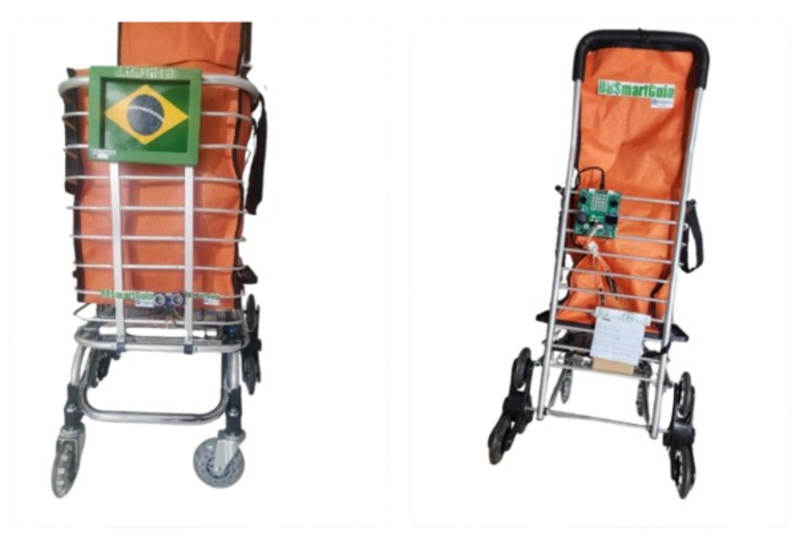

# Projetos de Sistemas Embarcados - EmbarcaTech 2025

**Autor**: Gabriel Martins Ribeiro

**Curso**: Residência Tecnológica em Sistemas Embarcados

**Instituição**: EmbarcaTech - HBr

*Brasília, março de 2025*

---

## Sobre este repositório

Este repositório reúne os projetos desenvolvidos ao longo do curso de Sistemas Embarcados, durante a etapa de residência. Sendo assim, cada projeto tem sua própria pasta, contendo o código-fonte, documentação e recursos visuais.

---

## 📂 Lista de Projetos

| Projeto | Descrição | Site |
|---------|-----------| ---- |
| 
 [🛒 BR SmartGuia](https://github.com/Gabrielrmg/gabriel_martins_ribeiro_embarcatech_HBr_2025/tree/main/projects/BR%20Smart%20Guia)
 | O BR SmartGuia é um dispositivo assistivo projetado para auxiliar pessoas com deficiência visual em ambientes urbanos e comerciais | https://gabrielrmg.github.io/EMBARCATECH/ |
| 🕹️ [Joystick_read](projects/joystick_read) | Projeto para leitura de eixos analógicos e botão de joystick com exibição no display OLED e monitor serial| — |
|  [**Countdown_Display**](projects/countdown_display) | Projeto que exibe contagem regressiva no display OLED após botão ser pressionado | — |
|  [Internal_Temp_Monitor](projects/internal_temp_monitor) | Projeto que exibe a temperatura interna do chip RP2040 no display OLED | — |

## 📝 Diário de Bordo (Reflexões e Aprendizados)

| Semana     | Aprendizados |
|------------|--------------|
| Semana 1   | Entendi como funciona a comunicação I2C com displays OLED. |
| Semana 2   | Execução dos 3 projetos:  [Joystick_read](projects/joystick_read) , [Countdown_Display](projects/countdown_display) e [Internal_Temp_Monitor](projects/internal_temp_monitor)  |
| Semana 3   | Commit dos 3 projetos no GitHub|

## Licença
GPL-3.0
