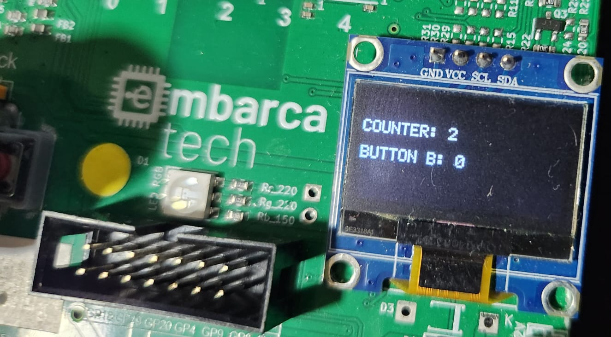

# ⏱️ Countdown Display

  

**Autor:** Gabriel Martins Ribeiro  
**Engenheiro Eletrônico – FCTE – UnB**

Este projeto realiza uma contagem regressiva, de 9 até 0 segundos, com exibição em display OLED SSD1306 e monitor serial.  
O acionamento é feito pelo botão A. Além disso, é registrado o número de vezes que o botão B foi pressionado dentro desse intervalo de 9 segundos.

---

## 🧩 Estrutura do Código

A seguir, uma visão geral dos principais arquivos do projeto:

| Arquivo               | Descrição                                                                 |
|-----------------------|---------------------------------------------------------------------------|
| [`main.c`](https://github.com/Gabrielrmg/gabriel_martins_ribeiro_embarcatech_HBr_2025/blob/main/projects/countdown_display/src/main.c) | Código principal do firmware responsável pela contagem regressiva         |
| [`ssd1306.c`](https://github.com/Gabrielrmg/gabriel_martins_ribeiro_embarcatech_HBr_2025/blob/main/projects/countdown_display/src/ssd1306.c) | Funções para controle do display OLED SSD1306                            |
| [`ssd1306.h`](https://github.com/Gabrielrmg/gabriel_martins_ribeiro_embarcatech_HBr_2025/blob/main/projects/countdown_display/src/ssd1306.h) | Cabeçalho com definições da interface OLED                                |
| [`font.c`](https://github.com/Gabrielrmg/gabriel_martins_ribeiro_embarcatech_HBr_2025/blob/main/projects/countdown_display/src/font.c) | Fontes utilizadas para exibição                                           |
| [`font.h`](https://github.com/Gabrielrmg/gabriel_martins_ribeiro_embarcatech_HBr_2025/blob/main/projects/countdown_display/src/font.h) | Cabeçalho da fonte                                                        |
| [`pico_sdk_import.cmake`](https://github.com/Gabrielrmg/gabriel_martins_ribeiro_embarcatech_HBr_2025/blob/main/projects/countdown_display/src/pico_sdk_import.cmake) | Importação do Pico SDK                                                   |
| [`CMakeLists.txt`](https://github.com/Gabrielrmg/gabriel_martins_ribeiro_embarcatech_HBr_2025/blob/main/projects/countdown_display/src/CMakeLists.txt) | Configuração de build com CMake                                          |

---

## ⚙️ Funcionalidades Implementadas

✅ Contagem regressiva visível no display  
✅ Início da contagem por botão físico  
✅ Comunicação via I2C com o display OLED  
✅ Compatível com Raspberry Pi Pico e Pico W  

---

## 💻 Requisitos

- Raspberry Pi Pico ou Pico W  
- Display OLED 128x64 com SSD1306 (I2C)  
- Botão físico conectado a GPIO  
- SDK oficial da Raspberry Pi Pico  
- Ambiente com suporte a CMake

